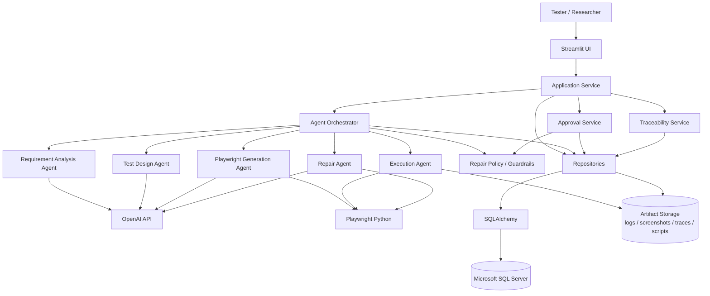
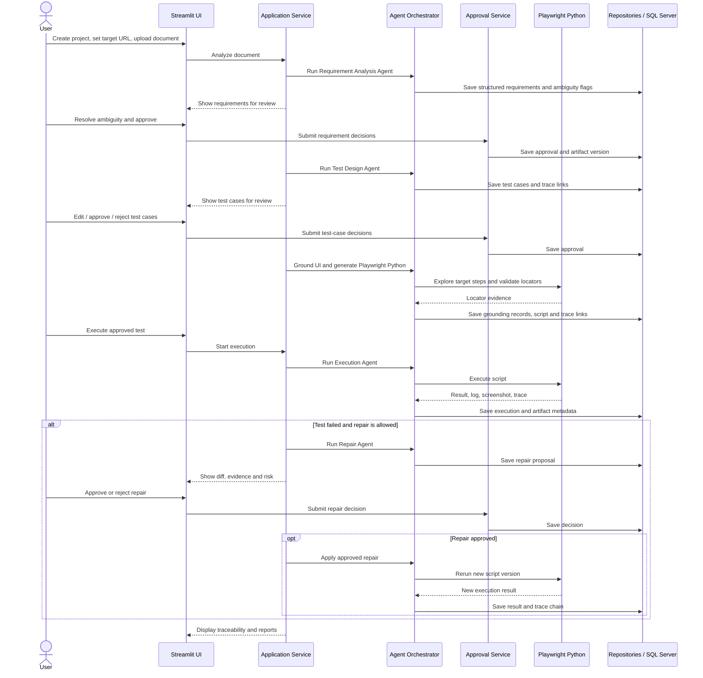

# Kiến trúc hệ thống v0.1

## 1. Trạng thái tài liệu

- Phiên bản: 0.1
- Loại tài liệu: Kiến trúc sơ bộ cho Thesis MVP
- Phạm vi: Luồng xuyên suốt từ tài liệu yêu cầu đến Playwright Python test, thực thi, constrained repair, human approval và traceability
- Trạng thái: Đề xuất để review

## 2. Mục tiêu kiến trúc

Kiến trúc phải hỗ trợ các mục tiêu sau:

1. Chuyển tài liệu yêu cầu thành requirement có cấu trúc và định danh.
2. Không cho phép requirement còn thiếu hoặc mơ hồ đi tiếp nếu chưa được xác nhận.
3. Sinh test case có liên kết truy vết đến requirement.
4. Ground test step và locator trên UI thật trước khi sinh Playwright Python.
5. Thực thi test và lưu log, screenshot, trace cùng kết quả.
6. Chỉ cho phép repair trong phạm vi policy; thay đổi ngữ nghĩa phải được con người phê duyệt.
7. Truy vết được toàn bộ chuỗi từ requirement đến execution và repair.

## 3. Nguyên tắc thiết kế

- **Human-governed:** Agent đề xuất; người dùng quyết định tại các điểm ảnh hưởng requirement, test oracle hoặc ý nghĩa test case.
- **Traceable by design:** Mỗi artifact phải có ID, version, nguồn sinh và liên kết với artifact trước đó.
- **Structured agent output:** Agent phải trả về JSON theo Pydantic schema, không truyền free-form text trực tiếp giữa các bước cốt lõi.
- **Fail closed:** Khi output không hợp lệ, thiếu evidence hoặc còn ambiguity chưa xử lý, pipeline phải dừng ở trạng thái chờ review.
- **Evidence-based grounding:** Locator chỉ được chấp nhận khi có UI evidence và kết quả kiểm tra trên website thật.
- **Policy-controlled repair:** Repair Agent không trực tiếp quyết định thay đổi assertion, expected result, test step hoặc traceability.
- **Reproducible execution:** Lưu model/prompt version, application URL/version, Playwright version, cấu hình chạy và repair attempt.

## 4. Kiến trúc tổng thể



### 4.1 Điều chỉnh so với sơ đồ khởi đầu

Approval Service không được đặt bên trong Agent Orchestrator như một tool mà agent có thể tự gọi để hợp thức hóa quyết định. Đây là service kiểm soát độc lập do Application Service điều phối và chỉ ghi nhận quyết định từ người dùng.

Execution và Repair có thể nằm chung một package trong phiên bản đầu, nhưng phải tách thành hai trách nhiệm logic:

- Execution Agent chạy test và thu bằng chứng, không tự sửa.
- Repair Agent chỉ tạo proposal từ failure evidence, không tự áp dụng proposal chưa được phép.

Traceability Service cũng là thành phần độc lập vì trace link không nên do agent tùy ý tạo, xóa hoặc thay đổi mà không qua validation/approval.

## 5. Trách nhiệm các thành phần

### 5.1 Streamlit UI

- Tạo và chọn project.
- Nhập website name, base URL và start URL.
- Upload tài liệu yêu cầu.
- Hiển thị requirement/test case cần review.
- Hiển thị UI grounding evidence và mã Playwright được sinh.
- Khởi chạy execution.
- Approve/reject repair proposal.
- Hiển thị traceability matrix, coverage và lịch sử.

Streamlit UI không gọi trực tiếp agent, OpenAI API, Playwright hoặc database. Mọi use case đi qua Application Service.

### 5.2 Application Service

- Cung cấp các use case cho UI.
- Kiểm tra trạng thái project và điều kiện trước khi chuyển bước.
- Điều phối transaction và persistence.
- Gọi Agent Orchestrator cho tác vụ AI/automation.
- Gọi Approval Service tại approval gate.
- Không chứa prompt hoặc logic suy luận chuyên biệt của agent.

### 5.3 Agent Orchestrator

- Điều phối thứ tự agent theo workflow đã định nghĩa.
- Chuẩn bị input có cấu trúc cho từng agent.
- Validate output bằng Pydantic schema.
- Lưu run metadata: model, prompt version, token/cost nếu có, thời gian và trạng thái.
- Dừng pipeline khi schema validation thất bại hoặc approval còn pending.
- Không có quyền tự phê duyệt artifact.

### 5.4 Requirement Analysis Agent

- Nhận document text đã được parser trích xuất.
- Nhận diện requirement và vị trí nguồn.
- Chuẩn hóa actor, precondition, action, expected outcome và constraints.
- Gán ambiguity/missing/conflict flags.
- Không tự đánh dấu requirement mơ hồ là đã được giải quyết.

### 5.5 Test Design Agent

- Chỉ nhận requirement đã approved.
- Sinh positive, negative, boundary, error guesing, alternative-flow test khi có căn cứ.
- Gắn requirement ID với scenario, test case và test step.
- Không tự tạo expected result vượt quá requirement đã duyệt.

### 5.6 Playwright Generation Agent

- Chỉ nhận test case đã approved.
- Yêu cầu Playwright khảo sát UI theo test step thay vì crawl toàn bộ website.
- Thu locator candidate từ DOM/accessibility information.
- Ưu tiên locator theo role/label/placeholder/text/test ID.
- Kiểm tra matched element count và lưu UI evidence.
- Sinh Playwright Python/Pytest từ test case và grounding record.

### 5.7 Execution Agent

- Chạy Playwright Python test trong cấu hình được khóa.
- Thu stdout/stderr, structured log, screenshot và Playwright trace.
- Lưu execution result và liên kết artifact.
- Phân loại trạng thái ban đầu: passed, failed, error hoặc blocked.
- Không sửa test trong cùng bước execution.

### 5.8 Repair Agent

- Nhận failed execution, log, trace, screenshot, script và traceability context.
- Phân tích failure và tạo repair proposal dạng diff.
- Gắn failure type, risk level, semantic impact, lý do và evidence.
- Tuân theo repair policy và repair budget.
- Không tự áp dụng proposal cần approval.

### 5.9 Approval Service

- Quản lý approval request và approval decision.
- Xác nhận artifact version đang được review.
- Lưu người quyết định, thời gian, quyết định và lý do.
- Ngăn artifact bị thay đổi sau khi gửi review mà không tạo version mới.
- Không sử dụng LLM để thay thế quyết định của người dùng.

### 5.10 Traceability Service

- Tạo và kiểm tra trace link theo loại được phép.
- Tính requirement coverage.
- Truy ngược từ execution/repair về requirement nguồn.
- Phát hiện orphan artifact hoặc broken trace link.
- Yêu cầu approval khi thay đổi trace link đã được duyệt.

### 5.11 Persistence và artifact storage

- SQLAlchemy cung cấp repository abstraction và ánh xạ domain entity sang SQL Server.
- SQL Server lưu metadata, structured artifact, trạng thái, version, trace link và approval history.
- Script, log, screenshot và trace dung lượng lớn lưu trong `artifacts/` hoặc object/file storage; database lưu URI/path, checksum và metadata.
- Repository layer là đường truy cập dữ liệu duy nhất của Application Service và các service nghiệp vụ.

## 6. Luồng xử lý Thesis MVP



## 7. Input/output sơ bộ của agent

| Agent | Điều kiện trước | Input | Output |
|---|---|---|---|
| Requirement Analysis Agent | Document parsing thành công | Document text, source metadata, parser result | Structured requirements, source spans, ambiguity/missing/conflict flags |
| Test Design Agent | Requirement version đã approved | Approved requirements, generation policy | Test scenarios, positive/negative/boundary test cases, test steps và trace links |
| Playwright Generation Agent | Test case version đã approved | Approved test cases, target website, setup/seed information | Grounding records, locator evidence, Playwright Python scripts |
| Execution Agent | Script đã validate và môi trường sẵn sàng | Python scripts, execution configuration, test data | Execution results, logs, screenshots, traces, failure evidence |
| Repair Agent | Execution failed và còn repair budget | Failed result, failure evidence, trace, screenshot, script, approved test case | Failure classification, repair proposal, diff, risk level, semantic-impact flag |

## 8. Approval gates

| Gate | Trigger | Artifact bị khóa | Quyết định |
|---|---|---|---|
| AG-01 Requirement ambiguity | Requirement thiếu, mơ hồ hoặc mâu thuẫn | Requirement version | Edit/clarify, approve hoặc reject |
| AG-02 Test-case review | Trước UI grounding và code generation | Test-case version | Approve, reject hoặc edit thành version mới |
| AG-03 Assertion change | Repair thêm, xóa hoặc làm yếu assertion | Script/test-case version | Approve hoặc reject |
| AG-04 Expected-result change | Repair thay expected outcome/oracle | Requirement và test-case version | Approve hoặc reject; ưu tiên sửa requirement trước |
| AG-05 Test-step removal/change | Repair bỏ hoặc thay đổi nghiệp vụ của step | Test-case version | Approve hoặc reject |
| AG-06 Traceability change | Thêm, xóa hoặc thay trace link đã duyệt | Trace-link version | Approve hoặc reject |
| AG-07 Mark unexecutable | Agent đề xuất blocked/skip/unexecutable | Test-case execution status | Approve hoặc reject với lý do |

Ngoài bảy điểm bắt buộc trên, MVP nên yêu cầu review khi thay test data có ý nghĩa nghiệp vụ hoặc khi Repair Agent không phân biệt được lỗi test với lỗi thật của ứng dụng.

## 9. Repair policy sơ bộ

| Mức | Thay đổi | Hành vi MVP |
|---|---|---|
| Low risk | Locator tương đương đã được UI-grounded; web-first wait; import/syntax không đổi logic | Tạo proposal; có thể áp dụng sau approval đơn giản |
| Medium risk | Navigation, setup, test data hoặc action parameter | Bắt buộc review evidence và approval |
| High risk | Assertion, expected result, test step, skip/unexecutable status hoặc trace link | Bắt buộc approval; không tự động áp dụng |
| Prohibited | Sửa source code website; xóa evidence/history; lặp repair không giới hạn | Từ chối thực hiện |

Repair budget mặc định đề xuất là tối đa hai proposal/application attempts cho một execution chain. Khi vượt budget hoặc thiếu evidence, trạng thái chuyển thành `BLOCKED_FOR_REVIEW`.

## 10. Domain entities sơ bộ

Các entity tối thiểu cần được mô hình hóa:

- `Project`
- `TargetWebsite`
- `SourceDocument`
- `DocumentExtraction`
- `Requirement`
- `RequirementVersion`
- `AmbiguityFinding`
- `TestScenario`
- `TestCase`
- `TestCaseVersion`
- `TestStep`
- `UIGroundingRecord`
- `GeneratedScript`
- `ExecutionRun`
- `ExecutionArtifact`
- `FailureAnalysis`
- `RepairProposal`
- `ApprovalRequest`
- `ApprovalDecision`
- `TraceLink`
- `AgentRun`

Các artifact có thể thay đổi sau review phải có version riêng. Execution result và approval decision là append-only; không cập nhật đè lịch sử.

## 11. Traceability model

Chuỗi truy vết chuẩn:

```text
Source Document
→ Requirement Version
→ Test Scenario
→ Test Case Version
→ Test Step
→ UI Grounding Record
→ Generated Script Version
→ Execution Run
→ Failure Analysis
→ Repair Proposal
→ Approval Decision
→ Repaired Script Version
→ Rerun Execution
```

Mỗi trace link tối thiểu có:

- Source artifact type và ID/version.
- Target artifact type và ID/version.
- Loại quan hệ.
- Nguồn tạo: user, rule hoặc agent run ID.
- Trạng thái validation/approval.
- Thời gian tạo.

## 12. Ranh giới Thesis MVP

### Trong kiến trúc MVP

- Một Streamlit application.
- Một Application Service và Agent Orchestrator.
- Một OpenAI provider.
- Playwright Python/Pytest, ưu tiên Chromium và chạy tuần tự.
- DOCX, text-based PDF, Markdown và TXT.
- Microsoft SQL Server qua SQLAlchemy.
- Artifact storage cục bộ cho script/log/screenshot/trace.
- Human approval và history.

### Chưa đưa vào kiến trúc MVP

- Đăng nhập nhiều role và phân quyền phức tạp.
- RAG/vector database phức tạp.
- Nhiều LLM provider.
- Distributed/parallel execution.
- CI/CD hoàn chỉnh.
- Dashboard đồ họa nâng cao.
- OCR cho scanned PDF.
- Tự sửa source code website.
- Autonomous repair loop không giới hạn.

## 13. Rủi ro kiến trúc ban đầu

| Rủi ro | Ảnh hưởng | Giảm thiểu |
|---|---|---|
| Agent trả output không đúng schema | Pipeline không ổn định | Pydantic validation, retry có giới hạn, fail closed |
| Requirement mơ hồ nhưng agent tự suy diễn | Oracle/test case không có căn cứ | Ambiguity gate và requirement approval bắt buộc |
| Locator tồn tại nhưng sai ngữ nghĩa | Test chạy nhưng thao tác sai | Lưu semantic UI evidence và review grounding |
| Repair làm test pass bằng cách làm yếu test | Kết quả thực nghiệm sai | Risk policy, semantic-impact flag, approval và versioned diff |
| Không phân biệt lỗi test với lỗi website | Repair che bug thật | Failure taxonomy, evidence bundle và trạng thái blocked-for-review |
| Artifact lớn làm nặng SQL Server | Hiệu năng/lưu trữ kém | Lưu file ngoài DB, DB chỉ lưu metadata/path/checksum |
| Workflow bị gắn chặt với Streamlit | Khó test và mở rộng | UI chỉ gọi Application Service; domain/service không import Streamlit |

## 14. Quyết định cần chốt ở phiên bản tiếp theo

1. Dùng Playwright sync API hay async API; MVP chỉ nên chọn một.
2. Cách cung cấp authentication/setup: seed test, storage state hay thao tác thủ công.
3. Cách lưu artifact cục bộ và quy ước đường dẫn/checksum.
4. Schema Pydantic chính thức cho Requirement, TestCase, GroundingRecord và RepairProposal.
5. State machine chính thức cho project, artifact review và execution.
6. Failure taxonomy và allowlist/denylist repair chi tiết.
7. Prompt/model versioning và dữ liệu cần lưu để tái lập thực nghiệm.
8. Chiến lược xác định target application version trong evaluation.

## 15. Công việc tiếp theo

Thứ tự tiếp theo là hợp lý nếu triển khai như sau:

1. Chốt bốn schema lõi: Requirement, TestCase, UIGroundingRecord và RepairProposal.
2. Chốt project/workflow state machine và bảy approval gates.
3. Vẽ data model/ERD từ các domain entities.
4. Định nghĩa API/use case của Application Service.
5. Định nghĩa interface và prompt contract cho từng agent.
6. Chọn sync/async Playwright API, authentication setup và artifact convention.
7. Xây một vertical slice trên một requirement và một test case.
8. Sau khi luồng chạy được, hoàn thiện sáu module của Thesis MVP và mở rộng sang các ứng dụng thực nghiệm.

## 16. Kết luận

Kiến trúc đề xuất phù hợp với Thesis MVP và research gap đã chốt. Điểm cần giữ vững là Agent Orchestrator không được kiêm quyền phê duyệt, Approval Service và Traceability Service phải độc lập về trách nhiệm, còn mọi agent output cốt lõi phải được validate, version và lưu bằng chứng. Với các ranh giới này, hệ thống vừa triển khai được luồng Agentic AI xuyên suốt vừa bảo vệ test oracle và ý nghĩa test case trước repair tự động.
