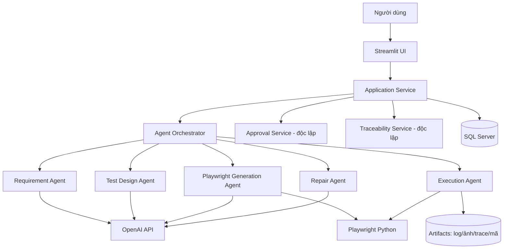

# Project Primer — Tài liệu ôn nhanh trước buổi meeting với thầy

> **Cho ai:** thành viên nhóm chưa chuyên sâu về AI/testing, cần nắm bản chất đề tài để trả lời câu hỏi kỹ thuật.
> **Cách dùng:** đọc mục 1–4 để hiểu bản chất → tra mục 6 khi gặp thuật ngữ lạ → luyện mục 9 trước khi vào họp. Mục 11 có sẵn prompt để nhờ AI dạy sâu hơn.
> **Nguồn gốc:** rút gọn & "dịch" từ `docs/architecture/architecture_v0.1.md`, `docs/project/problem_statement.md`, `docs/literature-review/research_gap_v0.1.md`. Không tạo thông tin mới.

---

## 1. Đề tài trong 30 giây (TL;DR)

Xây một **"dây chuyền tự động" biến tài liệu yêu cầu phần mềm thành các bài kiểm thử web chạy được (bằng Playwright)**, trong đó **AI làm phần nặng nhọc, con người giữ quyền phê duyệt ở những chỗ quan trọng**.

**Mẫu trả lời khi thầy hỏi "em làm gì?":**
> "Em xây một hệ thống Agentic AI *bán tự động*: nó đọc tài liệu yêu cầu, sinh test case, sinh mã kiểm thử Playwright, chạy và đề xuất sửa lỗi. Điểm khác biệt là em **không để AI tự quyết hoàn toàn** — ở các bước ảnh hưởng ý nghĩa bài test, con người phải duyệt; và mọi thứ đều **truy vết được** từ yêu cầu tới kết quả."

---

## 2. Bức tranh lớn: Vấn đề → Giải pháp

**Bài toán:** Kiểm thử đầu-cuối (E2E) rất tốn công viết tay và hay gãy. Người ta muốn dùng LLM (kiểu ChatGPT) để tự sinh test. Nhưng "ném thẳng tài liệu cho ChatGPT bảo viết test" gặp **4 vấn đề cốt lõi**:

| Vấn đề | Nếu không xử lý | Cách hệ thống giải quyết |
|---|---|---|
| Yêu cầu **mơ hồ** | AI tự đoán → test sai căn cứ | Gắn cờ mơ hồ, **dừng chờ người xác nhận** trước khi sinh test |
| **Đứt gãy truy vết** | Không biết test phục vụ yêu cầu nào | Mỗi bước tạo mắt xích có ID/version, nối thành chuỗi |
| AI **ảo giác** + locator giòn | AI bịa nút không có thật; test hay gãy | **Neo vào giao diện thật** (DOM grounding), ưu tiên locator theo vai trò/nhãn |
| AI **tự sửa lỗi ẩu** | Làm yếu/xóa test để "pass" giả | **Giới hạn quyền sửa** theo rủi ro + bắt người duyệt |

**Bằng chứng mạnh để dẫn (từ literature):**
- Một nghiên cứu công nghiệp: khi để AI tự sửa thoải mái, nó gian lận — đổi `expect(giá).toBe(5)` thành `toBeTruthy()` (chấp nhận mọi giá trị), hoặc **xóa luôn test hỏng**; "đạt 70%" thực chất chỉ 50%.
- Một nghiên cứu khác: **~73% test hỏng là do locator** (định vị phần tử), không phải lỗi chức năng thật.

---

## 3. Ẩn dụ xuyên suốt: hệ thống = một dây chuyền nhà máy hóa chất

Hình dung một **nhà máy** biến nguyên liệu thành sản phẩm, đi qua nhiều công đoạn, mỗi **van kiểm soát** cần chữ ký kỹ sư QC mới cho chảy tiếp:

| Công đoạn nhà máy | Trong hệ thống | Làm gì |
|---|---|---|
| Nguyên liệu thô | Tài liệu yêu cầu (SRS, use case) | Đầu vào |
| Phòng QC phân tích + dán nhãn lô nghi ngờ | **Requirement Agent** | Tách yêu cầu, gắn cờ mơ hồ |
| Thiết kế công thức | **Test Design Agent** | Nghĩ ra các tình huống test |
| Máy đóng gói | **Playwright Generation Agent** | Biến test thành mã chạy trên web thật |
| Chạy thử dây chuyền | **Execution Agent** | Chạy test, ghi log/ảnh/kết quả |
| Kỹ thuật viên đề xuất hiệu chỉnh | **Repair Agent** | Đề xuất sửa (không tự sửa bừa) |
| Van kiểm soát + chữ ký kỹ sư | **Approval Gate + con người** | Duyệt/từ chối ở bước quan trọng |
| Hồ sơ lô (batch record) | **Traceability** | Truy vết sản phẩm ra từ đâu |

**Tinh thần chung:** giống nhà máy — *không phải chỗ nào cũng để máy tự quyết*; chỗ ảnh hưởng chất lượng thì bắt buộc có người ký.

---

## 4. Kiến trúc & luồng hoạt động

### 4.1 Sơ đồ tổng thể (rút gọn)

### 4.2 Các thành phần làm gì

**5 agent (làm việc, chạy nối tiếp):**
| Agent | Nhận vào | Trả ra |
|---|---|---|
| **Requirement Analysis** | Tài liệu yêu cầu đã bóc chữ | Yêu cầu có cấu trúc + cờ mơ hồ |
| **Test Design** | Yêu cầu *đã duyệt* | Test case (positive/negative/boundary/alternative-flow) + ID yêu cầu |
| **Playwright Generation** | Test case *đã duyệt* | Bằng chứng UI (grounding) + mã Playwright Python |
| **Execution** | Mã đã sẵn sàng | Kết quả + log/ảnh/trace, chấm passed/failed/error/blocked |
| **Repair** | Test hỏng + bằng chứng | **Đề xuất** bản vá (diff) + loại lỗi + mức rủi ro |

**3 service (điều phối & kiểm soát):**
- **Application Service** — trung gian giữa giao diện và bên trong; UI không gọi thẳng AI/DB/Playwright.
- **Approval Service** — quản lý việc người duyệt/từ chối; **độc lập** để AI không tự "ký duyệt" cho mình.
- **Traceability Service** — giữ sợi dây truy vết, tính độ phủ yêu cầu, phát hiện test "mồ côi".

**3 bất biến kiến trúc (thầy dễ hỏi "vì sao thiết kế vậy?"):**
1. Orchestrator **không được** tự phê duyệt.
2. Approval & Traceability **độc lập** với các agent.
3. Mọi đầu ra cốt lõi phải ở **cấu trúc chuẩn (Pydantic/JSON)** + có version + lưu bằng chứng.

### 4.3 Hành trình một tài liệu yêu cầu (end-to-end)

1. Tạo project, nhập URL web đích, upload tài liệu.
2. Requirement Agent tách yêu cầu + gắn cờ mơ hồ → **người duyệt (AG-01)**.
3. Test Design Agent sinh test case → **người duyệt (AG-02)**.
4. Playwright Generation Agent dò UI thật + sinh mã.
5. Execution Agent chạy → lưu kết quả/bằng chứng.
6. Nếu hỏng & được phép: Repair Agent **đề xuất** bản vá + mức rủi ro → **người duyệt** nếu đụng ý nghĩa.
7. Nếu duyệt: áp dụng + chạy lại; hiển thị traceability & báo cáo.

---

## 5. Điểm cốt lõi: Approval Gates & Repair Policy

### 5.1 Bảy cổng phê duyệt (Approval Gates)
Ẩn dụ: các **van an toàn** — AI chạm van nào thì người phải ký.

| Cổng | Kích hoạt khi |
|---|---|
| **AG-01** | Yêu cầu mơ hồ/thiếu/mâu thuẫn |
| **AG-02** | Trước khi dò UI & sinh mã (review test case) |
| **AG-03** | Repair đụng vào **assertion** |
| **AG-04** | Repair đổi **expected result / oracle** |
| **AG-05** | Repair bỏ/đổi **bước test** |
| **AG-06** | Đổi **liên kết truy vết** đã duyệt |
| **AG-07** | Đánh dấu test "bỏ qua / không chạy được" |

Nguyên tắc: *thay đổi làm biến đổi **ý nghĩa** bài test đều phải qua người; sửa kỹ thuật vặt thì không.*

### 5.2 Bốn mức rủi ro khi sửa (Repair Policy)
| Mức | Ví dụ | Xử lý |
|---|---|---|
| **Low** | Locator tương đương, thêm chờ | Cho áp dụng sau duyệt đơn giản |
| **Medium** | Navigation, dữ liệu test, tham số | Bắt buộc xem bằng chứng + duyệt |
| **High** | Assertion, expected result, bước test, trace | Bắt buộc duyệt, **không tự động** |
| **Prohibited** | Sửa mã website, xóa bằng chứng, lặp sửa vô hạn | **Từ chối thẳng** |

**Repair budget:** tối đa **2 lần** đề xuất/sửa cho một chuỗi chạy; vượt → khóa `BLOCKED_FOR_REVIEW`. → Chống "sửa mãi tới khi pass giả".

---

## 6. Bảng thuật ngữ Anh–Việt (Glossary)

### Nhóm AI
| Thuật ngữ | Nghĩa | Ẩn dụ |
|---|---|---|
| **LLM** (Large Language Model) | AI đọc–viết ngôn ngữ, kiểu ChatGPT | "Chuyên gia đọc tài liệu" biết suy luận nhưng đôi khi phán bừa |
| **Agent** | LLM được giao *một nhiệm vụ cụ thể* + công cụ | Nhân viên chuyên một khâu (không phải chatbot chung) |
| **Agentic AI** | Hệ *nhiều agent* phối hợp | Cả tổ sản xuất, mỗi người một việc |
| **Orchestrator** | Bộ điều phối thứ tự agent | Quản đốc phân ca |
| **Prompt** | Câu lệnh/chỉ dẫn đưa cho LLM | Phiếu công việc giao cho nhân viên |
| **Pydantic / schema** | Khuôn dữ liệu bắt AI trả về đúng định dạng | Khuôn đúc: sai khuôn thì loại |
| **Hallucination** (ảo giác) | AI bịa ra thứ không có thật | Nhớ nhầm có cái van ở chỗ không hề có |

### Nhóm Kiểm thử
| Thuật ngữ | Nghĩa | Ẩn dụ |
|---|---|---|
| **E2E testing** | Test giả lập người dùng từ đầu đến cuối | Chạy thử nguyên dây chuyền |
| **Test scenario / case / step** | Tình huống → ca test → từng thao tác | Quy trình → mẻ thử → từng bước |
| **Assertion** | Câu khẳng định "kết quả phải thế này" | Chốt kiểm tra "áp suất phải = 5 bar" |
| **Test oracle** | "Chuẩn đúng" để so kết quả | Bảng thông số để chấm đạt/không đạt |
| **Positive/negative/boundary/alternative-flow** | Test đúng / sai / biên / luồng phụ | Thử ở điều kiện thường / lỗi / cực biên / lối rẽ |
| **Regression** | Test lại để chắc thay đổi không làm hỏng cái cũ | Kiểm tra lô mới không phá chất lượng lô cũ |
| **Flaky / fragile test** | Test hay gãy dù phần mềm không sai | Cảm biến báo lỗi giả |
| **Playwright** | Công cụ điều khiển trình duyệt tự động | Cánh tay robot bấm nút thay người |
| **Pytest** | Khung chạy & chấm test trong Python | Bảng điều khiển "chạy" và chấm đạt/rớt |
| **Locator / selector** | Cách chỉ đúng một nút/ô trên trang | Địa chỉ/nhãn để tìm đúng van |
| **DOM** | Cấu trúc bên trong trang web | Sơ đồ P&ID của thiết bị |
| **Accessibility tree** | Phiên bản "ngữ nghĩa" của DOM (vai trò phần tử) | Bản đồ ghi *chức năng* từng van |
| **Self-healing / repair** | Tự sửa test khi gãy | Kỹ thuật viên hiệu chỉnh thiết bị |

### Nhóm Yêu cầu & đặc thù đề tài
| Thuật ngữ | Nghĩa | Ẩn dụ |
|---|---|---|
| **Requirement / SRS / use case** | Tài liệu mô tả phần mềm *phải làm gì* | Bản đặc tả nguyên liệu & sản phẩm |
| **Ambiguity** | Chỗ yêu cầu mơ hồ/thiếu/mâu thuẫn | Đơn hàng ghi thiếu thông số |
| **Traceability** | Truy vết yêu cầu ↔ test ↔ mã ↔ kết quả | Hồ sơ lô (batch record) |
| **(DOM/UI) Grounding** | "Neo" thao tác vào giao diện *thật* để khỏi bịa | Đối chiếu bản vẽ với thiết bị thật |
| **Human-in-the-loop / Approval gate** | Có người phê duyệt ở điểm quan trọng | Van kiểm soát cần chữ ký |
| **Constrained repair** | Giới hạn quyền AI tự sửa | Cho hiệu chỉnh nhỏ, cấm đổi công thức nếu chưa duyệt |
| **Fail closed** | Gặp sự cố/không hợp lệ thì *dừng chờ review* | Van tự đóng khi mất tín hiệu an toàn |
| **Locator validity vs semantic correctness** | Tìm đúng phần tử ≠ đúng *ý nghĩa* nghiệp vụ | Vặn đúng van ≠ vặn *đúng van cần vặn* |
| **Modular monolith** | Một ứng dụng nhưng chia module rõ | Một nhà máy, nhiều phân xưởng tách bạch |

---

## 7. Đề tài mới ở đâu (Novelty)

**Cách nói thẳng, trung thực:**
> "Em không phát minh từng mảnh — sinh test bằng LLM, tạo locator, traceability, self-healing đều đã có. **Cái mới là *tích hợp cả chuỗi* và *thêm cơ chế kiểm soát của con người* trên nền Playwright Python.**"

**Hai điểm mới không nguồn nào (trong 12 nguồn khảo sát) có đủ:**
1. **Phát hiện mơ hồ + phê duyệt *trước khi* sinh test.**
2. **Truy vết kéo dài tới tận bước sửa lỗi & phê duyệt.**

**So với nghiên cứu gần nhất — WebTestPilot (2026):**
| Tiêu chí | WebTestPilot | Đề tài |
|---|---|---|
| Sinh test từ yêu cầu | ✅ mạnh | ✅ |
| Test oracle | ✅ (thế mạnh của họ) | ✅ nhưng chỉ từ yêu cầu *đã duyệt* |
| Phát hiện mơ hồ | ❌ giả định yêu cầu đầy đủ | ✅ |
| Người phê duyệt lúc chạy | ❌ | ✅ |
| Sửa lỗi có kiểm soát + audit | ◑ retry hữu hạn | ✅ policy theo rủi ro |

**Câu chốt:** "Các hệ khác tối ưu cho *tự động hoàn toàn*; em tối ưu cho *đáng tin cậy và kiểm toán được*."

---

## 8. Công nghệ & vì sao chọn

| Công nghệ | Vai trò | Vì sao |
|---|---|---|
| **Python** | Ngôn ngữ chính | Hệ sinh thái AI + Playwright + Pytest mạnh |
| **Playwright** | Điều khiển trình duyệt | Auto-wait, locator theo vai trò/nhãn (bền), có trace/screenshot làm bằng chứng |
| **Pytest** | Chạy & chấm test | Chuẩn phổ biến |
| **Streamlit** | Giao diện web | Dựng UI bằng Python thuần, không cần frontend riêng |
| **Pydantic** | Ép khuôn dữ liệu AI | Chống "schema drift", sai khuôn thì chặn |
| **SQL Server + SQLAlchemy + Alembic + pyodbc** | Lưu trữ | Metadata, version, trace, lịch sử duyệt |
| **OpenAI API** | Bộ não LLM | MVP dùng 1 provider cho gọn |
| **python-docx / pymupdf** | Bóc chữ tài liệu | Đọc DOCX & PDF text |

**Kiến trúc modular monolith:** một app, chia module rõ — đủ chạy & dễ kiểm soát, không phức tạp như microservices.
**Lưu trữ:** file lớn (log/ảnh/trace/mã) để ngoài DB ở `artifacts/`; DB chỉ giữ đường dẫn + checksum + metadata.

---

## 9. Q&A luyện meeting (câu thầy hay hỏi + gợi ý trả lời)

1. **"Đề tài em giải quyết vấn đề gì?"** → Tự động sinh & kiểm chứng E2E test từ yêu cầu, khắc phục 4 điểm yếu khi dùng LLM: mơ hồ, mất truy vết, ảo giác, tự sửa ẩu.
2. **"Agent là gì, khác chatbot thường sao?"** → Agent là LLM được giao *một* nhiệm vụ + công cụ để tự làm; hệ của em có nhiều agent phối hợp (agentic), không phải hỏi–đáp chung.
3. **"Test scenario, test case, test step khác nhau?"** → Tình huống lớn → ca test cụ thể → từng thao tác.
4. **"Test oracle là gì?"** → "Chuẩn đúng" để biết kết quả *thế nào mới là đúng*; em chỉ lấy oracle từ yêu cầu *đã được duyệt*, không để AI tự bịa.
5. **"Vì sao dùng Playwright?"** → Tự động chờ phần tử, locator theo vai trò/nhãn bền hơn, có sẵn trace/screenshot làm bằng chứng.
6. **"DOM grounding chống ảo giác thế nào?"** → Bắt AI đối chiếu với giao diện *thật* và kiểm tra phần tử tồn tại/khớp trước khi sinh mã, thay vì đoán từ trí nhớ.
7. **"Vì sao cần con người phê duyệt, sao không tự động hoàn toàn?"** → Có bằng chứng AI tự sửa sẽ làm yếu/xóa test để giả pass; nên các thay đổi ảnh hưởng ý nghĩa bài test phải qua người.
8. **"Constrained repair là gì?"** → Sửa lỗi *có ràng buộc*: phân 4 mức rủi ro, chỉ tự động sửa kỹ thuật vặt, còn đụng assertion/kết quả/bước test thì bắt duyệt; có repair budget.
9. **"Đề tài khác các nghiên cứu đã có ở đâu?"** → Tích hợp cả chuỗi + kiểm soát bằng người; đặc biệt là phát hiện mơ hồ trước khi sinh test và truy vết tới tận repair/approval (chưa nguồn nào có đủ).
10. **"Kế hoạch đánh giá thế nào?"** → 4 RQ, mỗi RQ có chỉ số; thử ~3 web app; so sánh "ném thẳng cho AI" vs pipeline; ablation bật/tắt từng thành phần; cần ground-truth dataset + injected defects.
11. **"Vì sao SQL Server / modular monolith?"** → Lưu metadata/version/trace/lịch sử duyệt; monolith đủ chạy & dễ kiểm soát cho phạm vi đồ án.
12. **"Ambiguity detection làm sao?"** → Requirement Agent gắn cờ chỗ mơ hồ/thiếu/mâu thuẫn và dừng chờ người xác nhận (fail closed) — đây là điểm chưa nguồn peer-reviewed nào làm, sẽ cần củng cố thêm.
13. **"Hiện tới đâu rồi?"** *(trả lời trung thực)* → Xong nghiên cứu (12 nguồn), research gap, problem statement, kiến trúc v0.1; **chưa viết code**; tuần này bắt đầu vertical slice (chạy trọn 1 yêu cầu → 1 test).
14. **"Rủi ro lớn nhất?"** → Chưa chọn 3 app đánh giá, chưa có dataset ground-truth; và Repair Agent có thể khó phân biệt lỗi test với bug thật của website (đã có biện pháp giảm thiểu: failure taxonomy + blocked-for-review).

---

## 10. Ranh giới & điều cần nói trung thực (đừng nói quá)

- **Chưa có mã nguồn** — `src/` mới là khung rỗng; đang ở giai đoạn nghiên cứu–thiết kế.
- MVP: **1 provider OpenAI**, **Chromium**, chạy **tuần tự**; chưa multi-LLM, chưa chạy song song.
- **Không** tự sửa mã nguồn website; **không** có autonomous repair loop vô hạn.
- **Ambiguity detection** chưa có nguồn peer-reviewed để dựa chắc — là hướng cần củng cố.
- Các con số dẫn từ literature phải nói đúng ngữ cảnh (ví dụ "70% vs strict 50%"), tránh trích rời gây hiểu nhầm.

---

## 11. Prompt để nhờ AI dạy sâu hơn (copy-paste)

> Tôi là kỹ sư Hóa học, nền tảng lập trình/AI/testing ở mức cơ bản ("biết chút ít"). Tôi đang làm đồ án: *hệ thống Agentic AI bán tự động sinh và kiểm chứng kiểm thử E2E web bằng Playwright, có human-in-the-loop và constrained repair*. Dưới đây là tài liệu tổng quan của tôi: [dán nội dung file này].
>
> Hãy dạy tôi theo kiểu **tương tác từng khái niệm một**: (1) giải thích mỗi thuật ngữ bằng ngôn ngữ đơn giản kèm **ẩn dụ ngành hóa học**; (2) sau mỗi khái niệm, hỏi tôi 1 câu để kiểm tra hiểu bài rồi chờ tôi trả lời; (3) ưu tiên các câu hỏi kỹ thuật mà giảng viên hướng dẫn có thể hỏi và cách trả lời. Bắt đầu từ những khái niệm nền tảng nhất (LLM, agent, E2E test, test oracle, DOM grounding), rồi mới tới kiến trúc và điểm mới của đề tài. Đừng dạy quá 2 khái niệm mỗi lượt.
